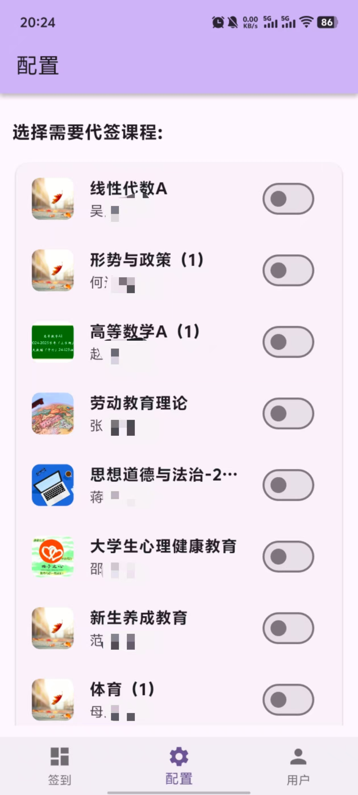
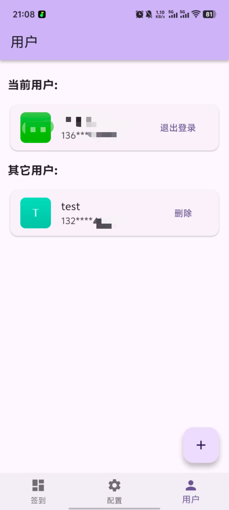

<center><div align="center">

</img>
# 学不通
### 一人签到，全寝睡觉
</div></center>

> `temp-android-only` 分支由 `52xiaohui` pr，其对扫码签到场景进行了优化【[PR详情](https://github.com/EnderWolf006/XBT/pull/6)】，但因无法适配Web暂未合并至主分支。<br>
> 同时，`XBT-Web` 原生实现正在开发中，使用 `Vue3` + `Varlet`，将大幅增加前端使用体验，敬请期待。

## 软件功能
- 自动识别同班同学
- 可选的代签生效课程
- 用户白名单机制(需手动在UserPerm添加)
- 帮助同使用本软件的同班同学签到
- 支持签到码/二维码/手势/位置(可自选)/普通签到
- 支持安卓客户端以及web网页端

## 技术栈
- 大前端: Flutter(Dart)
- 后端: Python(Flask, Pymysql)
- 数据库: Mysql

## 交流反馈
喜欢本项目的话，求点亮Star🙏
- [QQ群: 250369908](https://qm.qq.com/cgi-bin/qm/qr?k=yxbcu6vNZm3JvJElnCRHGbMgmNOADF6H&jump_from=webapi&authKey=+4fa+h7XTvKdeECaauj7wEFLOhVAkrtFNUh0VMcC3bP8eAeUqiXwctprZJOFHfkh)
- [Telegram: XueBT](https://t.me/XueBT)


## 实机截屏
| **签到主页** | **选课配置页** | **用户设置页** | **登录页** |
|:---:|:---:|:---:|:---:|
|<div align="center"> |<div align="center"> |<div align="center"> |<div align="center"> |
| **普通签到** | **手势签到** | **位置签到** | **签到码签到** |
|<div align="center"> |<div align="center"> |<div align="center"> |<div align="center"> |
| **二维码签到** | **签到结果页** |
|<div align="center"> |<div align="center"> |

## 食用教程
> 本教程稍有难度，需一定的计算机基础，如抱着“下载直接用”, “网上找个资源圈钱”的心态阅读此说明，可以洗洗睡了。

本教程分为四部分: 通用配置, 大前端部分, 数据库部分 和 后端部分。
开始前需先准备：
- 有公网IP的云服务器（Linux系统）
- 解析向服务器的域名（中国大陆需先备案）
- SSL证书(一般云服务商都会有免费证书)


### 教程内容总览

- 通用配置: 1. IDE 集成开发环境, 2. Python 开发环境, 3. 公私钥生成
- 大前端: 1. Flutter 开发环境, 2. 安装依赖, 3. 修改配置, 4. 测试, 5. 打包
- 数据库: 1. Mysql 安装, 2. Mysql 初始化
- 后端: 1. 安装依赖, 2. 修改配置, 3. 测试运行

### 通用配置

#### IDE 集成开发环境

鉴于你能看到本页面，本教程默认你已掌握科学上网能力（需开Tun模式）。

开始前还需安装git, [下载传送门](https://git-scm.com/downloads)
安装好后，找个你喜欢的文件夹打开终端，运行 `git clone https://github.com/EnderWolf006/XBT.git`

IDE使用 `vscode` 作为示例，[下载传送门](https://code.visualstudio.com/)。
<br>
安装vscode后，需要下载几个必要插件
- Python
- Dart
- Flutter

#### Python 开发环境
本项目使用python3，[下载传送门](https://www.python.org/downloads/)，建议下载3.13版本。需确保安装时勾选添加python到环境变量或安装后手动设置。

#### 公私钥生成
之所以Python开发环境没有放到后端部分，是因为在开始之前需要先使用python作为工具生成项目的公私钥。下面为生成方法

- 在项目根目录中打开终端
- 命令行输入 `pip install pycryptodome`
- 安装好后继续输入 `python ./Tools/genKey.py` 生成你独一无二的密钥对
- 生成好的公钥位于 `/Client/assets/keys/public.pem` 和 `Server/keys/public.pem` 中
- 生成好的私钥位于 `/Server/keys/private.pem` 中
- 检查它们是否成功生成，并妥善保管私钥，以防泄漏

### 大前端

#### Flutter 开发环境
先用vscode打开`/Client`, 然后参考官方文档配置即可`https://docs.flutter.dev/get-started/install/windows/mobile`

#### 安装依赖
vscode中打开`/Client/pubspec.yaml`文件，然后点击右上角下载图标与刷新图标等待完成即可

#### 修改配置
客户端配置在 `/Client/lib/config.example.dart` 中，使用vscode打开它，按照注释与预设的格式修改即可。修改完成后，先保存，然后重命名该文件为 `config.dart`

#### 测试
在vscode中打开 `/Client/lib/main.dart` ，在右下角选择设备浏览器或者安卓,然后点击右上角小箭头即可运行

#### 打包
- 在`/Client/`文件夹终端输入 `flutter build apk --release` 打包安卓客户端
- `flutter build web --debug` 打包Web端
注：Web端打包release会玄学报错，有大佬知道如何修复欢迎PR

### 数据库

#### Mysql 安装
你需要在你的云服务器上安装mysql，
参考链接[传送门](https://blog.csdn.net/weixin_45626288/article/details/133220238)

#### Mysql 初始化
Mysql 初始化文件在 `Server/xbt.sql` 中，在你的Mysql中创建一个名为xbt(你自己命名也可以，等下需要这个名字配置后端)的库并运行此文件。

数据库可视化工具推荐：Navicat Lite[传送门](https://www.navicat.com/en/products/navicat-premium-lite)，现在已经可以免费用正版基础功能了

### 后端
接下来的操作均需要将`/Server`上传到服务器上运行, 推荐使用vscode远程连接可视化操作

#### 安装依赖
在 `/Server` 中打开终端，运行 `pip install -r requirements.txt` 安装后端依赖

#### 修改配置
打开 `/Server/mysql.example.json`, 修改其内容为你的数据库配置。保存后将文件名重命名为 `mysql.json`

#### 测试运行
在 `/Server` 打开终端，运行 `python ./index.py` 即可运行，服务将开放于3030端口，此时就可使用flutter端进行测试了。

测试无误后，就可以部署上线了，推荐使用以下步骤及工具
- 终端运行 `screen -S server` 开启一个窗口
- 在新 `server` 窗口中cd进`/Server`
- 运行 `python ./index.py`
- 使用 `ctrl` + `a` + `d` 退出
- 配置 `Nginx` 反向代理
```conf
# HTTP 到 HTTPS 重定向
server {
    listen 80;
    # 替换为你的域名
    server_name xbt.example.com api.xbt.example.com;
    return 301 https://$host$request_uri;
}

# Web 静态文件服务
server {
    listen 443 ssl;
    # 替换为你的域名
    server_name xbt.example.com;

    # SSL 证书路径（需替换为实际路径）
    ssl_certificate /home/ubuntu/Nginx/keys/xbt.crt;
    ssl_certificate_key /home/ubuntu/Nginx/keys/xbt.key;

    # 可选的 SSL 配置优化
    ssl_protocols TLSv1.2 TLSv1.3;
    ssl_prefer_server_ciphers on;
    ssl_ciphers EECDH+AESGCM:EDH+AESGCM:AES256+EECDH:AES256+EDH;

    # 静态文件根目录（需替换为你的实际路径）
    root /home/ubuntu/web;
    index index.html index.htm;
    
    location / {
        try_files $uri $uri/ /index.html; # 支持 SPA（单页应用），可选
    }
}

# API 后端配置
server {
    listen 443 ssl;
    # 替换为你的域名
    server_name api.xbt.example.com;

    # SSL 证书路径（需替换为实际路径）
    ssl_certificate /home/ubuntu/Nginx/keys/api.crt;
    ssl_certificate_key /home/ubuntu/Nginx/keys/api.key;

    # 可选的 SSL 配置优化
    ssl_protocols TLSv1.2 TLSv1.3;
    ssl_prefer_server_ciphers on;
    ssl_ciphers EECDH+AESGCM:EDH+AESGCM:AES256+EECDH:AES256+EDH;

    location / {
        proxy_pass http://localhost:3030;
        proxy_set_header Host $host;
        proxy_set_header X-Real-IP $remote_addr;
        proxy_set_header X-Forwarded-For $proxy_add_x_forwarded_for;
        proxy_set_header X-Forwarded-Proto $scheme;
        fastcgi_buffers 256 128k;
        chunked_transfer_encoding off;
        # python没有处理跨域问题，这里反代处理, 添加 CORS 头
        add_header 'Access-Control-Allow-Origin' '*' always;
        add_header 'Access-Control-Allow-Methods' 'GET, POST, OPTIONS, PUT, DELETE' always;
        add_header 'Access-Control-Allow-Headers' 'DNT,User-Agent,X-Requested-With,If-Modified-Since,Cache-Control,Content-Type,Range,Token,Version' always;

        # 处理 OPTIONS 预检请求
        if ($request_method = 'OPTIONS') {
            add_header 'Access-Control-Allow-Origin' '*' always;
            add_header 'Access-Control-Allow-Methods' 'GET, POST, OPTIONS, PUT, DELETE' always;
            add_header 'Access-Control-Allow-Headers' 'DNT,User-Agent,X-Requested-With,If-Modified-Since,Cache-Control,Content-Type,Range,Token,Version' always;
            add_header 'Content-Length' 0;
            return 204;
        }
    }
}
```

## 免责声明
本项目仅作为交流学习使用，通过本项目加深网络通信、接口编写、交互设计等方面知识的理解，请勿用作商业用途，任何人或组织使用项目中代码进行的任何违法行为与本人无关。如有触及相关平台规定或者权益，烦请联系我删除。         

## 开源协议

本软件遵循 `GPLv3` 开源协议，以下为该协议内容解读摘要:

* 可自由复制 你可以将软件复制到你的电脑，你客户的电脑，或者任何地方。复制份数没有任何限制
* 可自由分发 在你的网站提供下载，拷贝到U盘送人，或者将源代码打印出来从窗户扔出去（环保起见，请别这样做）。
* 可以用来盈利 你可以在分发软件的时候收费，但你必须在收费前向你的客户提供该软件的 GNU GPL 许可协议，以便让他们知道，他们可以从别的渠道免费得到这份软件，以及你收费的理由。
* 可自由修改 如果你想添加或删除某个功能，没问题，如果你想在别的项目中使用部分代码，也没问题，唯一的要求是，使用了这段代码的项目也必须使用 GPL 协议。
* 如果有人和接收者签了合同性质的东西，并提供责任承诺，则授权人和作者不受此责任连带。